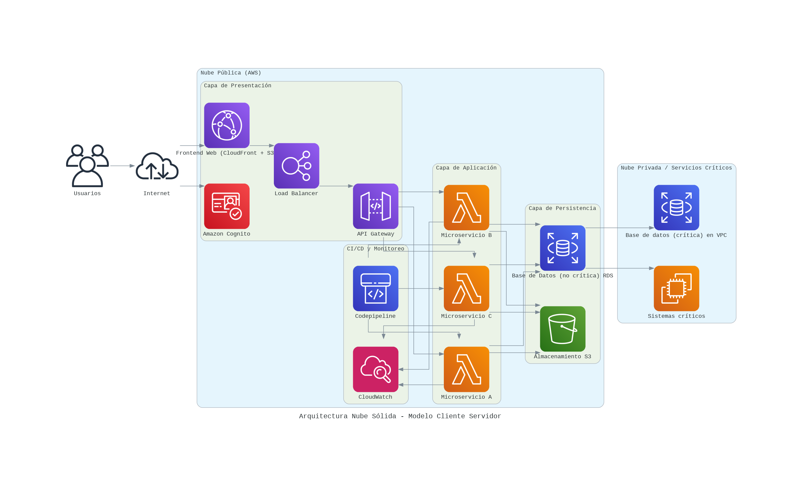

# ☁ Fundamentos de Arquitectura Cloud ☁

Este repositorio contiene las actividades realizadas para el bootcamp de Fundamentos de Arquitectura Cloud impartido por Alkemy, gracias al programa de Talento Digital para Chile.

Se trabajó con servicios de AWS, donde aprendí fundamentos teóricos de los diferentes servicios y también tuve acceso a una cuenta de estudiante para poder crear diferentes instancias a través de la consola de administración de AWS.

## 👨‍🏫 Objetivo del curso

El objetivo del bootcamp fue introducir los fundamentos de la arquitectura cloud y del rol del Arquitecto Cloud dentro del desarrollo de sistemas modernos.

Si bien el curso incluyó algunos laboratorios prácticos en AWS, el enfoque principal fue conceptual. A través de análisis de casos, elaboración de diagramas arquitectónicos y ejercicios de reflexión técnica, se buscó comprender cómo se diseñan sistemas escalables, resilientes y seguros en la nube.

Durante el curso se revisaron conceptos clave de computación en la nube, atributos de calidad en arquitectura de software y el funcionamiento general de distintos servicios de AWS, junto con algunos ejercicios prácticos de configuración de servicios como S3, RDS, VPC, SQS, SNS, EC2, entre otros.


## 🎯 Objetivos del repositorio

Este repositorio reúne las actividades desarrolladas durante el bootcamp de Fundamentos de Arquitectura Cloud.

![NOTE]
> Los documentos incluidos corresponden a ejercicios y proyectos realizados en la plataforma Alkemy, por lo que conservan el formato y material original del curso.

El objetivo de este repositorio es documentar el proceso de aprendizaje y los distintos temas abordados, entre ellos:

- Comprender los fundamentos de la computación en la nube.
- Conocer el rol y las responsabilidades de un Arquitecto Cloud.
- Analizar atributos de calidad en arquitecturas de software.
- Explorar diferentes servicios de AWS y sus casos de uso.
- Diseñar arquitecturas mediante diagramas y análisis de escenarios técnicos.

## 📁 Estructura del repositorio

```
📁 aws_projects
│
├─ 📁 M1
│   └─ 📄 AC-explorando-el-mercado-laboral-del-rol-profesional.pdf
│
├─ 📁 M2
│   └─ 📄 ABP-arquitectura-para-sistema-de-reservas-en-la-nube.pdf
│   └─ 📄 AC-evolucion-de-los-modelos-de-distribucion-de-software.pdf
│   └─ 📄 EA-escenarios-de-calidad-sistema-reservas.pdf
│
├── 📁 M3
│   └── ...
└─ README.md
```

Cada carpeta corresponde a un módulo del curso y contiene los ejercicios, análisis de casos, proyectos y código de algunos diagramas desarrollados durante esa unidad.

## 🛠️ Tecnologías utilizadas

### ☁ Cloud

- Servivios de AWS 

### 🔧 Control de versiones

- Git 
- GitHub 

### 🗄 Bases de datos

- PostgreSQL 

### 📊 Herramientas y diagramación

- Python 
- Google Colab 
- Mermaid 
- Draw.io 

Los diagramas del repositorio fueron generados usando Python y Google Colab,
además de herramientas como Mermaid y Draw.io para representar arquitecturas
de sistemas en la nube.

Ejemplo:



![TIP]
>**Recurso imporante:** Librería [diagrams](https://diagrams.mingrammer.com/docs/getting-started/installation)

## Tipos de actividades

>[!NOTE]
> En el repositorio, los archivos tienen diferentes códigos al inicio:

| Código | Tipo | Descripción |
|--------|------|-------------|
| ``ABP``| **A**prendizaje **B**asado en **P**royectos | Proyectos más grandes que buscan integrar los contenidos vistos a lo largo de las lecciones de cada módulo.
|``AC``| Análisis de Casos | Se trata de una consigna individual que desafía a reflexionar y proponer soluciones ante una situación técnica real o simulada.
|``EA``| Ejercicios de Aplicación | Actividades que invitan a poner en práctica lo visto en los módulos.


## #️⃣ Índice de módulos

| Módulo | Nombre |
|--------|--------|
| Módulo 1| Orientación al perfil de especialidades y metodología del curso.
| [Módulo 2](#módulo-2---el-rol-del-arquitecto-en-el-ciclo-de-vida-del-software) | El rol del arquitecto en el ciclo de vida del software.
| [Módulo 3](#módulo-3---fundamentos-de-la-arquitectura-cloud) | Fundamentos de la arquitectura cloud.
| [Módulo 4](#módulo-4---fundamentos-de-tecnología-cloud) | Fundamentos de tecnología cloud.
| [Módulo 5](#módulo-5---arquitecturas-cloud-básicas) | Arquitecturas cloud básicas.
| [Módulo 6](#módulo-6---arquitecturas-monolíticas-escalables) | Arquitecturas monolíticas escalables.
| [Módulo 7](#módulo-7---arquitecturas-de-microservicios) | Arquitecturas de microservicios.
| Módulo 8 | Arquitecturas serverless.
| Módulo 9 | Diseño y revisión de seguridad cloud.

## 📄 Ejercicios del Bootcamp de Arquitectura Cloud

### Módulo 2 - El rol del arquitecto en el ciclo de vida del software.

| Código | Proyecto | Descripción |
|------|----------|-------------|
| ``EA`` | [Escenarios de calidad para un sistema de gestión de reservas en línea](M2/EA-escenarios-de-calidad-sistema-reservas.pdf) | Definir los escenarios de calidad específicos para un sistema de gestión de reservas en lína. Se eligieron atributos de calidad clave y tres escenarios de calidad para cada atributo, especificando estímulo, contexto, respuesta esperada y métrica de respuesta.
| ``AC`` | [Evolución de modelos de distribución](M2/AC-evolucion-de-modelos-de-distribucion-de-software.pdf) | Evaluar las implicaciones de la transición de un modelo de negocio e infraestructura técnica de la empresa y proponer una estrategia para migrar el software de gestión empresarial a un modelo SaaS 
| ``ABP`` | [Arquitectura para sistema de reservas en la nube](M2/ABP-arquitectura-para-sistema-de-reservas-en-la-nube.pdf) | Propuesta de diseño de arquitectura basada en microservicios para un sistema de reservas en la nube que sea escalable, seguro y eficiente. 


### Módulo 3 - Fundamentos de la arquitectura cloud.

| Código | Proyecto | Descripción |
|------|----------|-------------|
| ``AC`` | [Introducción a la computación en la nube](M3/AC-introduccion-a-la-computacion-en-la-nube-M3.pdf) | Propuesta de migración de infraestructura on-premise de una empresa de desarrollo de software a un modelo de nube pública.
| ``EA`` | [Conceptos fundamentales de computación en la nube](M3/EA-fundamentos-computacion-en-la-nube.pdf) | Definición de conceptos fundamentales de computación en la nube aplicado a situación hipotética de migración de infraestructura local a la nube.
| ``AC`` | [Modelos de implemetnación en la nube](M3/AC-modelos-de-implementacion-en-la-nube.pdf) | Una empresa financiera enfrenta limitaciones en su infraestructura on-premise. Se propone migrar hacia un modelo de nube híbrida que permita equilibrar cumplimiento normativo y la seguridad con la eficiencia, escalabilidad y disponibilidad.
| ``AC`` | [Principales atributos de calidad en una arquitectura en la nube](M3/AC-principales-atributos-de-calidad-en-una-arquitectura-en-la-nube.pdf) | Diseño de una estrategia que garantice que la infraestructura en la nube de una empresa de servicios cumpla con los atributos de calidad adecuados.
| ``ABP``| [Proyecto Nube Sólida](M3/ABP-Nube-solida.pdf) | Desarrollo de un diseño conceptual de una arquitectura en la nube que integra los fundamentos de la computación cloud, aplicando principios de diseño arquitectónico y garantizando atributos clave como escalabilidad resiliencia y seguridad. Arquitectura basada en el modelo cliente-servidor, contemplado la elección y justificación de los modelos de servicio (IaaS, PaaS, SaaS, FaaS) y de implementación (nube pública, privada o híbrida), asegurando una solución robusta y adaptable a las necesidades del negocio.


### Módulo 4 - Fundamentos de tecnología cloud.

| Código | Proyecto | Descripción |
|------|----------|-------------|
| ``EA`` | [Configuración bucket S3](M4/EA-configurar-bucket-s3.pdf) | Paso a paso de cómo crear un bucket S3 en la consola de AWS, subir objetos, configurar política de ciclo de vida, verificación de la configuración, habilitación de versionado junto a su respectiva verificación y revisión de costos estimados.
| ``AC`` | [Servicios de bases de datos relacionales - Amazon RDS](M4/AC-servicios-de-bases-de-datos-relacionales.pdf) | Proyecto cuyo objetivo es diseñar, crear y configurar una instancia de Amazon RDS con el plan gratuito, garantizando tanto la  seguridad como la eficiencia en el acceso a los datos. 
| ``AC`` | [Servicios de red en la nube - VPC](M4/AC-servicios-de-red-en-la-nube-VPC.pdf) | El objetivo es diseñar y configurar una VPC en AWS utilizando la capa gratuita o recursos  disponibles en AWS Academy. El  objetivo es sentar las bases de la infraestructura de redes, asegurando que esté segmentada correctamente (subredes públicas y privadas), con reglas de seguridad adecuadas y posibilidades de conectividad híbrida a futuro.

### Módulo 5 - Arquitecturas cloud básicas.

| Código | Proyecto | Descripción |
|------|----------|-------------|
| ``AC`` | [Arquitecturas de Almacenamiento de Objetos en la nube](M5/AC-arquitectura-de-almacenamiento-de-objetos.pdf) | Diseño y justificación de una solución basada en el almacenamiento de objetos en la nube, que contempla escalabilidad, seguridad, eficiencia en costos y entrega de archivos multimedia.
| ``EA``| [Estrategias de almacenamiento y respaldo en la nube](M5/EA-estrategias-de-almacenamiento-y-respaldo-en-la-nube.pdf) | Diseño de una estrategia de respaldo híbrido para una empresa simulada. La tarea consistió en investigar y diseñar una propuesta técnica que combine el almacenamiento on-premise con soluciones de respaldo en la nube, justificando las decisiones.
| ``AC`` | [Disponibilidad de conetnidos de aplicaciones en cloud](M5/AC-disponibilidad-de-contenidos-de-aplicaciones-en-cloud.pdf) | Diseño de una arquitectura robusta que garantice la alta disponibilidad y distribución eficiente de contenidos multimedia. Además, se tuvo que  considerar la protección de los contenidos sensibles, el uso de redes de entrega de contenido (CDN), balanceadores de carga y estrategias de escalabilidad automática. El enfoque debe estar orientado a lograr una solución resiliente, segura y rentable. 


### Módulo 6 - Arquitecturas monolíticas escalables.

| Código | Proyecto | Descripción |
|------|----------|-------------|
| ``EA`` | [Implementación de una arquitectura monolítica](M6/EA-implementacion-de-una-arquitectura-monolitica.pdf) |  Elaboración d eun documento en que se explique de forma sencilla la implementación de servicios de mensajería en la nube (Amazon SQS y SNS).
| ``AC``| [Implementación mediante contenedores](M6/AC-implementacion-mediante-contenedores-de-aplicacion.pdf) | Propuesta para migrar una aplicación monolítica a un entorno basado en contenedores. Esto implica diseñar y crear un Dockerfile que contenga todas las dependencias necesarias para ejecutar la aplicación y documentar las ventajas y limitaciones del proceso de contenerización.
| ``AC``| [Implementación de Servicios de Mensajería cloud - SQS y SNS](M6/AC-implementacion-de-servicios-de-mensajeria-cloud.pdf) | Diseño y configuración de un sistema que utilice Amazon SQS para la gestión asíncrona de mensajes entre módulos y Amazon SNS para la difusión de notificaciones en tiempo real a diversos servicios.


### Módulo 7 - Arquitecturas de microservicios.
| Código | Proyecto | Descripción |
|------|----------|-------------|
| ``AC`` | [Representación de una arquitectura orientada a microservicios](M7/AC-representacion-de-una-arquitectura-orientada-a-microservicios.pdf) | Representar visualmente la modernización de CloudServicesCo mediante una arquitectura cloud que integra microservicios (Autenticación, Catálogo, Pedidos), balanceo de carga y bases de datos, con el fin de optimizar el flujo de datos y mitigar riesgos técnicos antes de la implementación.


## 🔁 Futuras mejoras

- Incorporar más ejemplos prácticos de implementación en AWS.
- Añadir diagramas arquitectónicos adicionales para complementar los análisis teóricos.
- Documentar paso a paso la configuración de algunos servicios utilizados en los laboratorios.
- Integrar pequeños proyectos prácticos que combinen varios servicios cloud.
- Grabar algunas demos de aplicaciones creadas.

## ✅ Lecciones aprendidas

Durante este bootcamp pude comprender mejor:

- El rol del Arquitecto Cloud y su importancia en el diseño de sistemas escalables.
- Las ventajas de la computación en la nube frente a infraestructuras tradicionales.
- La importancia de los atributos de calidad (seguridad, escalabilidad, rendimiento, disponibilidad) en el diseño de software.
- El valor de los servicios gestionados para reducir complejidad operativa.
- Cómo los distintos servicios de AWS pueden combinarse para construir arquitecturas modernas.
- La importancia del modelo de implementación y proveedor elegido dependiendo del área de cada industria.

## ✨ Agradecimientos

El acceso a este curso fue gracias a la Beca de Talento Digital para Chile 2025.

Agradezco profundamente la oportunidad de aprender algo completamente nuevo para mí. Quiero seguir fortaleciendo mis habilidades de cloud computing 😊✨

Gracias a esta beca también pude tener acceso a un año gratis de AWS Skill Builder, por lo que continúo avanzando en contenidos y práctica de los servicios de AWS.

## 👩‍🔬 Sobre mí

Soy Ingeniera en Biotecnología Molecular en transición hacia el área de Análisis e Ingeniería de Datos, con interés en automatización y arquitectura escalable de datos.

## 🚀 Nota Final

Estoy actualizando algunos proyectos de los módulos 6,7, 8 y 9 ya que hubo hartos ejercicios prácticos que me gustaría mejorar y documentar adecuadamente antes de subirlos. 